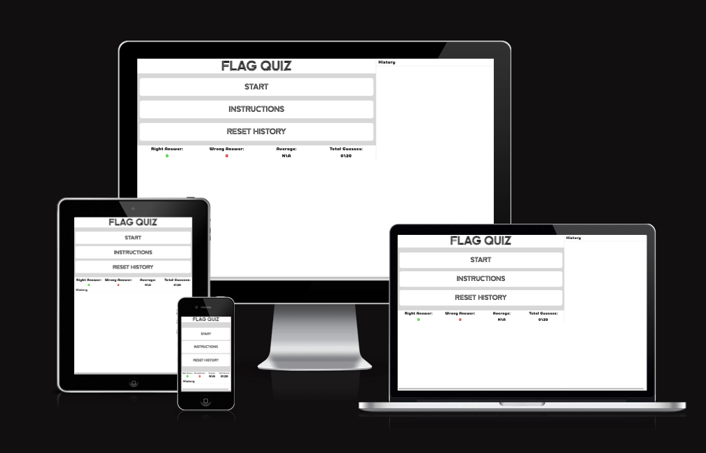

# Flag Quiz Game

# The purpouse of this project
The Flag Quiz is a game that tests your knowledge of the flags of all UN memebers states in a fun and engaging way, with the scores being easily print-screenable it is easy to challenge your friends and compare scores, even over more than 20 questions!

The reasons for the creation of this website as is, it is the second project of five from The Code Institute. The requirements for project 2 is to build a website using only HTML, CSS and Javascript.

The websites target audience is people whom are competetive and want to show off their knowledge of flags and to which country they belong, as well as people who wish to increase their knowledge of flags and countries. It is for all ages and since the right answer shows after each round, very educational!

## UX

### Scope

#### Website Demographic
- People who are looking for a challenge or to challenge people they know
 in flag trivia.
- People with some spare time to engage their brain.
- People wanting to learn more about the flags of the world.

#### Website Goals
 - Provide an enjoyable and engaging game that also educates you about flags of the world.
 - Providing all the necessary tools to flaunt/sheepishly share your impressive/embarresing score.
 - Having the user feeling happy about spending their time on the website.

### Design

#### Basic concept
The idea behind the design is less is more, with as few buttons as possible and distill the featues to the necessary for the goals of the website. 

#### Colours
The colour palette is made to be as expressive as possible, with black and white and gray for the animations and general style, blue for undecided, green for right and red for wrong.

Colour Palette reference from [Coolors](https://coolors.co/).

#### Typography

I got the fonts I used from [FontJoy](https://fontjoy.com/). I Used "Zen Tokyo Zoo" for the logo and for the menu buttons and Heebo for body text and answer buttons as the heavily styled font mentioned before would be too much for each button, the font for the score related areas is Coiny and I picked it and the logo style to emphasize that this is a place for fun.
These fonts are imported from [GoogleFonts](https://fonts.google.com/)

## Features

A website is one page split into a number of sections but they are all not visible at once.

### Header
The header is just the logo and it is responsive, scaling down as the screen get larger and smaller.

### Start Screen
The start screen is the first interactivable piece on the wesbite, it is a menu with 3 buttons:
- Start: Starts the game as it hides the start screen div and displays the flag img in its place, along with the answer options below it.
- Instructions: Pops up an instruction card over the rest of the website, as it fades out the background to ensure focus, it can be exited by the x on the top right.
- Reset History: Resets the history and current score.

### Flag Area
- Displays the flag of the correct answer, the flags are taken from [Flagpedia](https://flagpedia.net/) and their API, where you can display the svg flags on your webstie through embeding them. 

### Answer Area
The answer area is 4 different buttons and they have the following attributes:
- They all display a random country, with one of them corresponding to the flag that is displayed.
- On desktop they have a blue shadow effect on hover
- When pressing a button the correct answer will turn green and if it is not the answer you pressed, your pressed answer will also turn red, to show that your answer was wrong.

 

### Score area
- score area updates in real-time so you can see how you are doing, the round limit and how many rounds played

### History
- History shows you the scores of your previous rounds, when the history list is full it will say so in the header and will not accept any more entries untill the button "Reset History" has been pressed or the website has been reloaded.

The history is displaying the most recent round first when the history section is below the gameboard, but the opposite way when it is on the right of the gameboard on desktop width screns to accomodate the different expectations on the different formfactors.

### Features Left to Implement
- Highscore leaderboard that persists
- Alternate game modes ex:
    - Quick fire with answering as many questions as possible.
    - Having a timelimit per question to limit decision making time.
    - Extra hard where you get no answer options and you have to type the answer.
- Letting the player decide the round limit themselves.

## Technologies used

- [HTML](https://en.wikipedia.org/wiki/HTML)
- [CSS](https://en.wikipedia.org/wiki/CSS)
- [JavaScript](https://en.wikipedia.org/wiki/JavaScript)

## Testing
In addition the Google DevTools have been used to test other form-factors not available to me during this project.

### Tests Executed
- Screen Resize
    - Tested the programs responsiveness by resizing the screen between 1920px width and ~200px width and it is working as expected
- Buttons behaviour
    - Tested all the buttons to ensure that they do what is expected, for example, the start button starting a fresh round, the reset history removing all historical info, instructions button displaying the instructions and the answer buttons accurately showing if the answer is correct or not.
    - All buttons work as expected
- Button secondary behaviours check
    - Test secondary behaviour such as giving the proper feedback on the different devices and ensure that a multiclick doesnt result in extra scores being recorded.
    - all of it work as expected.
- History orientating check
    - History is adding to the order correctly for both positions.

### List of bugs squashed.
- Countries that have already been the correct answer continued to show up in the answers.
    - Reason: Found that I had not included the index of the thing I wished to remove in the slice function, so it removed the first item on the list of available countries istead.
    - Fix: Added the index of the object I wished to remove.
- Doubleclicking an answer resulted in the score being recorded twice.
    - Fix: Adding a boolean value checking if the buttons are on hold or not, with the correct/wrong button press functions opening up the boolean after they've run.

### Unfixed Bugs
 - A bug where hover effects are still visible on android using google chrome, but in the chrome devtools on desktop emulating a phone, they do not appear.

### Validator Testing
- HTML
    - Errors returned by the validator were:
        - Stray closing IMG tag that was removed
        - Empty src value for image, and it is empty in the beginning before a flag has been drawn, so it was not fixed.
[Validator Link](https://validator.w3.org/nu/?useragent=Validator.nu%2FLV+http%3A%2F%2Fvalidator.w3.org%2Fservices&acceptlanguage=&doc=https%3A%2F%2Ffrnbdn.github.io%2Fquiz-game%2F)
- CSS
    - One error of incorrect value for color, fixed. [Validator Link]https://jigsaw.w3.org/css-validator/validator?uri=https%3A%2F%2Ffrnbdn.github.io%2Fquiz-game%2F&profile=css3svg&usermedium=all&warning=1&vextwarning=&lang=en)

- JavaScript
    For JavaScript Validator I used both [Esprima](https://esprima.org/demo/validate.html) and [BeautifyTools](https://beautifytools.com/)
    Epsrima gave no syntax errors and BeautifyTools gave errors about template literal syntax and arrow functions. The only other error is also included in the screenshot from beautify tools.

- Lighthouse Testing

## Development and Deployment

This project has been made in full on Gitpod connected to GitHub where I have regularly been performing commits and pushes. The repo was started off with a template by the Code Institute. 

The Project is Deployed on GitHub pages.

Live link: https://frnbdn.github.io/quiz-game/

## Credits
## Sources
- https://flagpedia.net/
    - For the flags used in the game
- https://en.wikipedia.org/wiki/List_of_ISO_3166_country_codes
    - For the 2 letter country codes and all UN Recognized States
- https://fontawesome.com/
    - For the X icon
- https://coolors.co/
    - For the colour palette
- https://fonts.google.com/
    - For the fonts
- https://favicon.io/favicon-converter/
    - Favicon converter used
- https://en.wikipedia.org/wiki/Vexillology
    - Favicon taken from wikipedias Vexillology entry.
### List of Validators:
- https://beautifytools.com/javascript-validator.php
- https://esprima.org/demo/validate.html
- https://jigsaw.w3.org/css-validator/
- https://validator.w3.org/
- https://ui.dev/amiresponsive
- https://developer.chrome.com/docs/lighthouse/overview/
### Resources
#### Resources that i used during the course of this project for Inspiration and Knowledge.
- Code Institute Walkthrough and Projects
- https://developer.mozilla.org/en-US/
- https://stackoverflow.com/